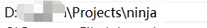
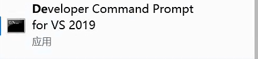

# 🛠️安装记录： NerfStudio on Windows11

# 2024-09-09

****

## 版本号

```
python==3.8
torch==2.1.2+cu118
torchvision==0.16.2+cu118
nerfstudio==1.1.4
cmake==3.29.1
Visual Studio 2019 + 2022(都装上备用) 
```

---

## 安装过程

1. 基础环境安装
   
   ```
   conda create --name nerfstudio -y python=3.8
   conda activate nerfstudio
   python -m pip install --upgrade pip
   ```

2. 安装PyTorch
   
   ```
   pip install torch==2.1.2+cu118 torchvision==0.16.2+cu118 --extra-index-url https://download.pytorch.org/whl/cu118
   ```

3. 安装 `ninja`
   - git clone,下载[ninja](https://github.com/ninja-build/ninja/releases) `https://github.com/ninja-build/ninja/releases`
   
     ```
     git clone https://github.com/ninja-build/ninja.git
     ```
   
   - 打开vs2022命令行工具
   
     

   - cd到`ninja目录`
   - 运行编译命令`python configure.py --bootstrap`
   - 添加环境变量`ninja目录`到Path
   
     
   
4. 安装 `tiny-cuda-nn` ：
   
   - git clone 
   
     ```
     git clone --recursive https://github.com/nvlabs/tiny-cuda-nn
     cd tiny-cuda-nn
     ```
   
   - 安装pytorch扩展（使用 **Developer Command Prompt for VS 2019**打开）
     
   
     ```
     cd tiny-cuda-nn/bindings/torch
     conda activate nerfstudio
     ```
     
   - 执行`python setup.py install`
   - 执行过程中若出现setup缺包相关错误，比如`No ...`
     ```
     pip packaging==22.0
     ```
     
   - 执行过程中可能出现： `“Error compiling objects for extension”` ，需要修改`tiny-cuda-nn\bindings\torch\setup.py`中的内容：
     
     ```
     # cmdclass={"build_ext": BuildExtension}
     # 修改为
     cmdclass={'build_ext': BuildExtension.with_options(use_ninja=False)}
     ```
   - 如果仍旧报错，运行以下命令转换`msvc`到x64版本（请自行索引到`Microsoft Visual Studio`的`vcvarsall.bat`）
     ```
     "C:\Program Files (x86)\Microsoft Visual Studio\2019\Community\VC\Auxiliary\Build\vcvarsall.bat" X64
5. 安装nerfstudio
    ```
    pip install nerfstudio
    ```
   
6. 如果web什么都不显示（浏览器console报错）
    ```
   # 浏览器报错：Failed to load module script: Expected a JavaScript module script but the server responded with a MIME type of "text/plain". Strict MIME type checking is enforced for module scripts per HTML spec.
   pip install viser==0.2.0
   #请忽略nerfstudio报版本不兼容错误！直接重新运行代码在浏览器中尝试查看即可
   ```
    _**Note**_: 降低viser版本会带来`KeyError: 'CameraMessage'`，但经笔者实践目前尚未发现该报错会带来什么影响，web可视化仍旧可用。