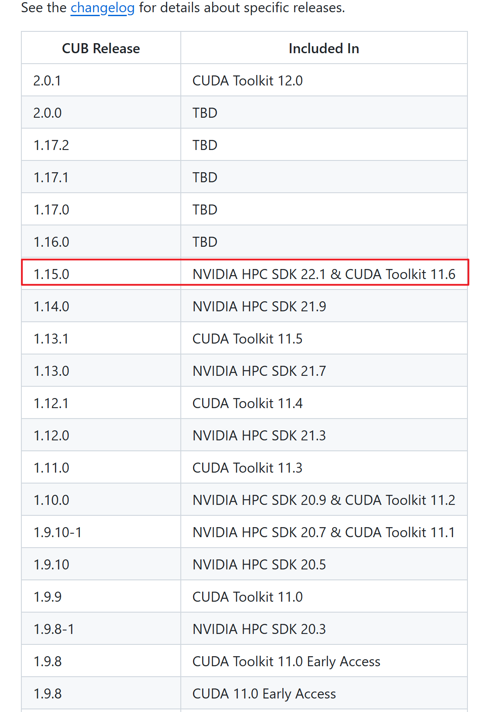

# 🛠️安装记录： Pytorch3d on Windows11

# 2024-07-17

****

## 版本号

```
python==3.8
pytorch==1.11.0 
torchvision==0.12.0 
torchaudio==0.11.0 
cudatoolkit=11.3
CUB==1.15.0
pytorch3d==0.7.2
```

---

## 安装过程

1. 基础环境安装
   
   ```
   conda create -n pytorch3d python=3.8
   #Install PyTorch
   conda install pytorch==1.11.0 torchvision==0.12.0 torchaudio==0.11.0 cudatoolkit=11.3 -c pytorch
   ```

2. 安装额外必需库
   
   ```
   conda install -c fvcore -c iopath -c conda-forge fvcore iopath
   ```

3. 下载指定版本pytorch3d
   
   - [Releases · facebookresearch/pytorch3d · GitHub](https://github.com/facebookresearch/pytorch3d/releases)`https://github.com/facebookresearch/pytorch3d/releases`
   
   - 选择版本的依据（如0.7.2，支持PyTorch 1.9.0 ~ 1.13.0)：
   
   

4. 修改 `pyTorch3d\setup.py` 文件：
   
   - **注释**掉 `extra_compile_args = {"cxx": ["-std=c++14"]}`  
   
   - **替换**为 `extra_compile_args = {"cxx": []}`

5. CUB 安装(因为CUDA低于**11.7**，所以才安装)
   
   - 下载与CUDA toolkit版本对应的CUB版本
     
       [NVIDIA CUB Releases](https://github.com/NVIDIA/cub/releases)`https://github.com/NVIDIA/cub/releases`
     
     
   
   - 下载后在系统环境变量中添加 变量名：`CUB_HOME`，指向CUB本地下载路径：`\~yourpath~\cub-1.15.0`  

6. 使用 VS2022 终端安装
   
   - 在windows中搜索"x64 Native Tools Command Prompt "终端中执行以下命令：
     
     ```
       set DISTUTILS_USE_SDK=1
     
       set PYTORCH3D_NO_NINJA=1
     
       cd \~yourpath~\pytorch3d
     
       conda activate pytorch3d
     
       python setup.py install
     ```
   
   - 若在过程中报错：`pyblind相关` 
     
     ```
     ...\ Lib \ site-packages \ torch \ include \ pybind11 \ cast . h ( 1429 ) : error : too few arguments for template template parameter Tuple
     ```
     
     在`cast.h`中注释以下内容，之后重新运行`python setup.py install`
     
     

  
