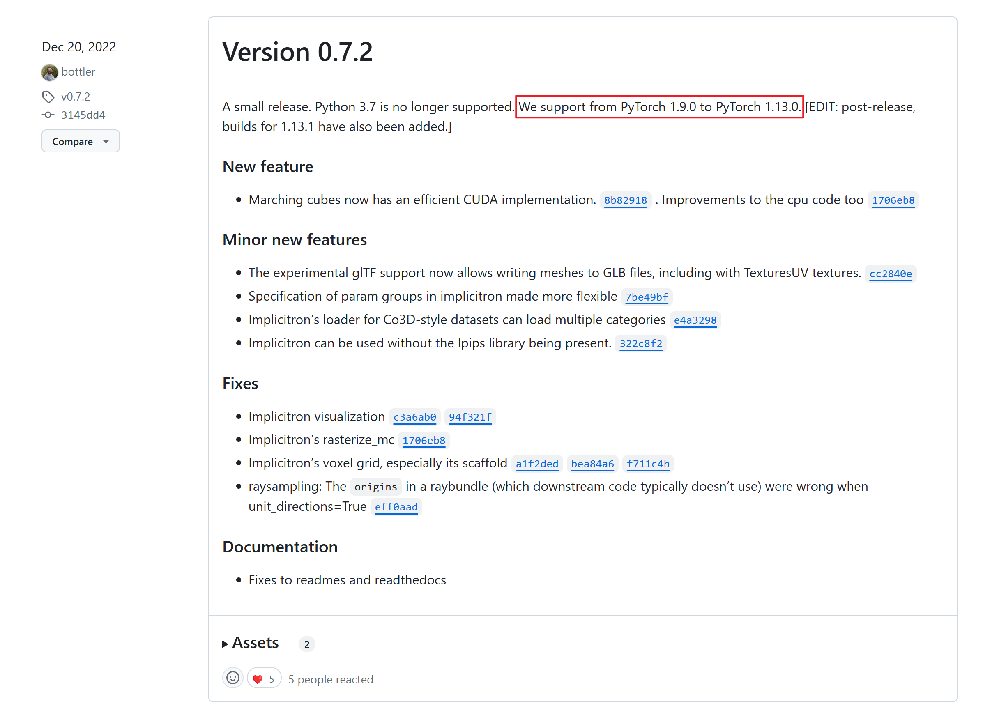
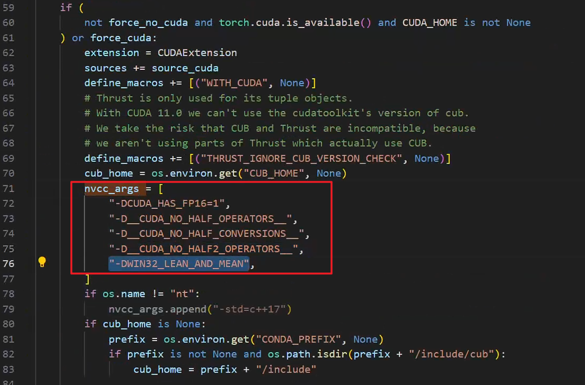
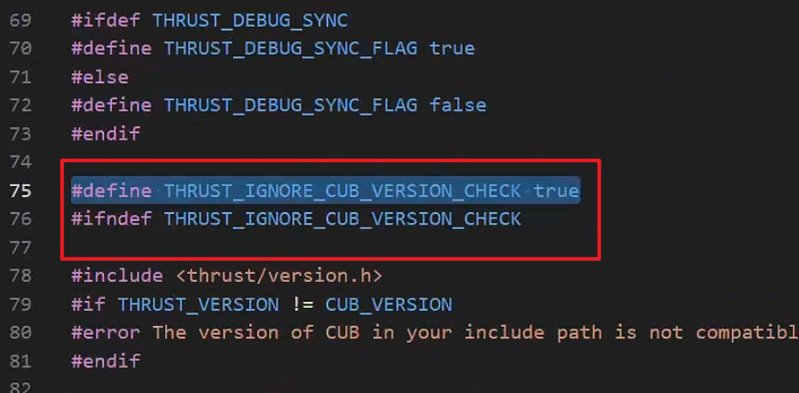
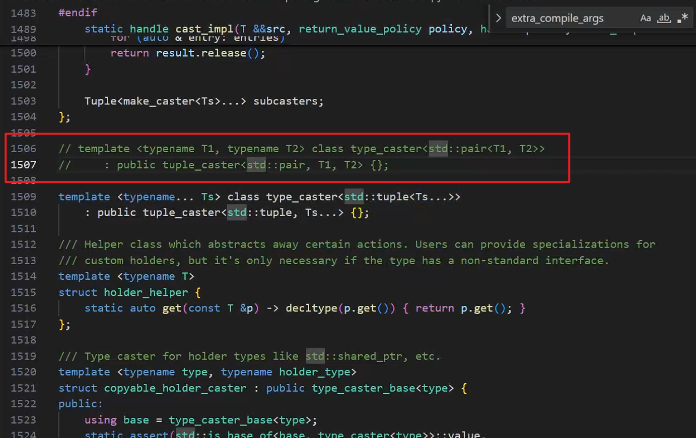

# 🛠️安装记录： Pytorch3d on Windows11

# 2024-09-15

****

## 版本号

```
python==3.8
torch==2.1.2+cu118
torchvision==0.16.2+cu118
pytorch3d==0.7.7
```

---

## 安装过程

1. 基础环境安装
   
   ```
   conda create -n pytorch3d python=3.8
   #Install PyTorch
   pip install torch==2.1.2+cu118 torchvision==0.16.2+cu118 --extra-index-url https://download.pytorch.org/whl/cu118
   ```

2. 安装额外必需库
   
   ```
   conda install -c fvcore -c iopath -c conda-forge fvcore iopath
   ```

3. 下载指定版本pytorch3d
   
   - [Releases · facebookresearch/pytorch3d · GitHub](https://github.com/facebookresearch/pytorch3d/releases)`https://github.com/facebookresearch/pytorch3d/releases`
   
   - 选择版本的依据（如0.7.7，支持PyTorch 2.0 ~ 2.3)：
   
   

4. 修改 `pyTorch3d\setup.py` 文件：
   
   - **注释**掉 `extra_compile_args = {"cxx": ["-std=c++14"]}`  
   
   - **替换**为 `extra_compile_args = {"cxx": []}`

5. CUB 安装(因为CUDA高于**11.7**，所以不用特别安装CUB)
   - 添加或修改在系统环境变量 变量名：`CUB_HOME`，指向CUB路径：
   ```
   C:\Program Files\NVIDIA GPU Computing Toolkit\CUDA\v11.8\include\cub
   ```

6. 在`setup.py`中搜索`nvcc_args`，添加 `"-DWIN32_LEAN_AND_MEAN"`，如下图：
   

7. 找到下面的文件：
   ```
   C:\Program Files\NVIDIA GPU Computing Toolkit\CUDA\v11.8\include\thrust\system\cuda\config.h
   ```
   
   搜索  `THRUST_IGNORE_CUB_VERSION_CHECK`:
     在`#ifndef THRUST_IGNORE_CUB_VERSION_CHECK`前加一行
     `#ifndef THRUST_IGNORE_CUB_VERSION_CHECK`
   
   

6. 使用 VS2022 终端安装
   
   - 在windows中搜索"x64 Native Tools Command Prompt "终端中执行以下命令：
     
     ```
       set DISTUTILS_USE_SDK=1
     
       set PYTORCH3D_NO_NINJA=1
     
       cd \~yourpath~\pytorch3d
     
       conda activate pytorch3d
     
       python setup.py install
     ```
   
   - 若在过程中报错：`pyblind相关` 
     
     ```
     ...\ Lib \ site-packages \ torch \ include \ pybind11 \ cast . h ( 1429 ) : error : too few arguments for template template parameter Tuple
     ```
     
     在`cast.h`中注释以下内容，之后重新运行`python setup.py install`
     
     

  
